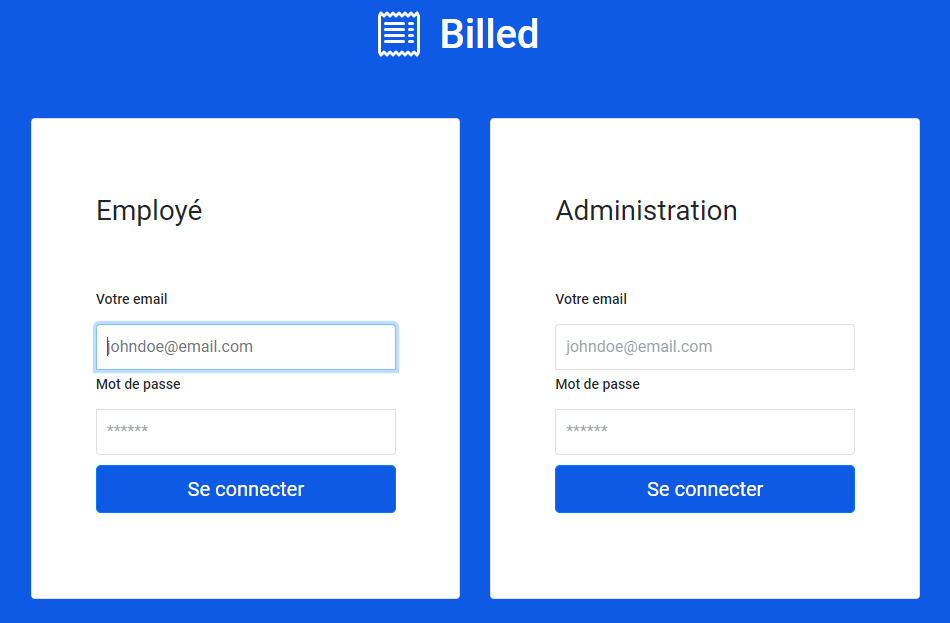

Openclassrooms Projet 9 : Débuggez et testez un SaaS RH - Site Billed



Le contexte du projet : 

Vous êtes développeur front-end chez Billed, une entreprise qui produit des solutions Saas destinées aux équipes de ressources humaines.

Malheureusement pour Billed, Garance, une collègue de la feature team “note de frais” a quitté l’entreprise avant d’avoir terminé l’application. Dans deux semaines, l’équipe doit montrer la solution qui fonctionne à l’ensemble de l’entreprise. Matthieu, Lead Developer de la feature team a demandé à être aidé pour tenir les délais et vous avez appris hier lors de la réunion d’équipe que c’est vous qui avez été désigné !

Le cahier des charges : 

 - [Bug - report] : Fixer les bugs identifiés dans le rapport de bug fourni par Jest. 

 - [Bug - hunt]  : Fixer les bugs identifiés par Leila sur le parcours employé.

 - [Tests unitaires et d’intégration] : Ajouter des tests unitaires et d’intégration pour les fichiers Bills et NewBill. 

 - [Test End-to-End] : Rédiger un plan de test End-to-End (E2E) sur le parcours employé

## L'architecture du projet :
Ce projet, dit frontend, est connecté à un service API backend que vous devez aussi lancer en local.

Le projet backend se trouve ici: https://github.com/OpenClassrooms-Student-Center/Billed-app-FR-back

## Organiser son espace de travail :
Pour une bonne organization, vous pouvez créer un dossier bill-app dans lequel vous allez cloner le projet backend et par la suite, le projet frontend:

Clonez le projet backend dans le dossier bill-app :
```
$ git clone https://github.com/OpenClassrooms-Student-Center/Billed-app-FR-Back.git
```

```
bill-app/
   - Billed-app-FR-Back
```

Clonez le projet frontend dans le dossier bill-app :
```
$ git clone https://github.com/OpenClassrooms-Student-Center/Billed-app-FR-Front.git
```

```
bill-app/
   - Billed-app-FR-Back
   - Billed-app-FR-Front
```

## Comment lancer l'application en local ?

### étape 1 - Lancer le backend :

Suivez les indications dans le README du projet backend.

### étape 2 - Lancer le frontend :

Allez au repo cloné :
```
$ cd Billed-app-FR-Front
```

Installez les packages npm (décrits dans `package.json`) :
```
$ npm install
```

Installez live-server pour lancer un serveur local :
```
$ npm install -g live-server
```

Lancez l'application :
```
$ live-server
```

Puis allez à l'adresse : `http://127.0.0.1:8080/`


## Comment lancer tous les tests en local avec Jest ?

```
$ npm run test
```

## Comment lancer un seul test ?

Installez jest-cli :

```
$npm i -g jest-cli
$jest src/__tests__/your_test_file.js
```

## Comment voir la couverture de test ?

`http://127.0.0.1:8080/coverage/lcov-report/`

## Comptes et utilisateurs :

Vous pouvez vous connecter en utilisant les comptes:

### administrateur : 
```
utilisateur : admin@test.tld 
mot de passe : admin
```
### employé :
```
utilisateur : employee@test.tld
mot de passe : employee
```
